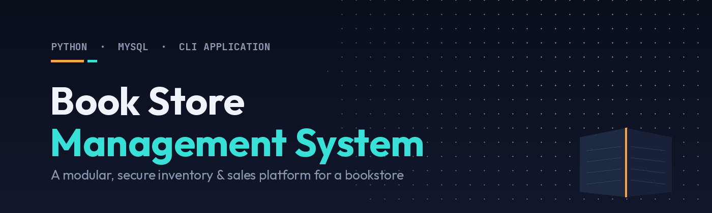
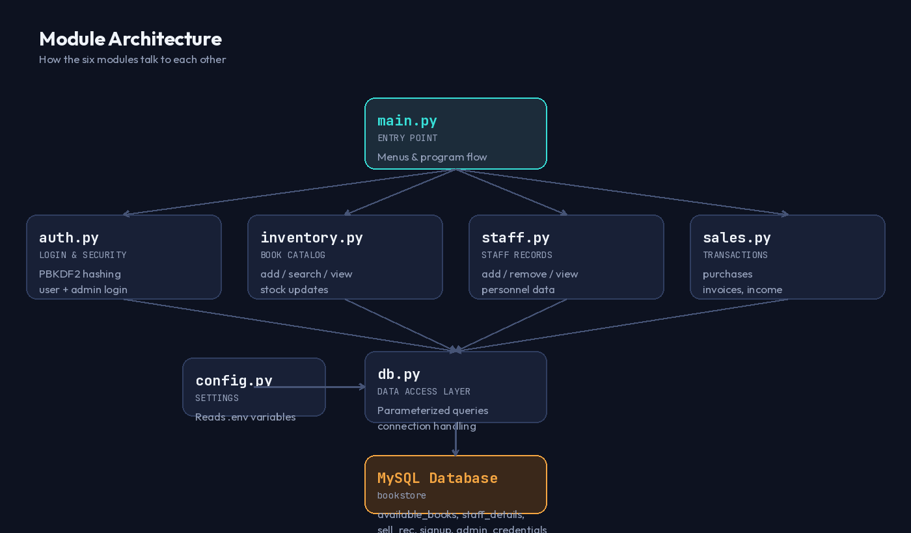
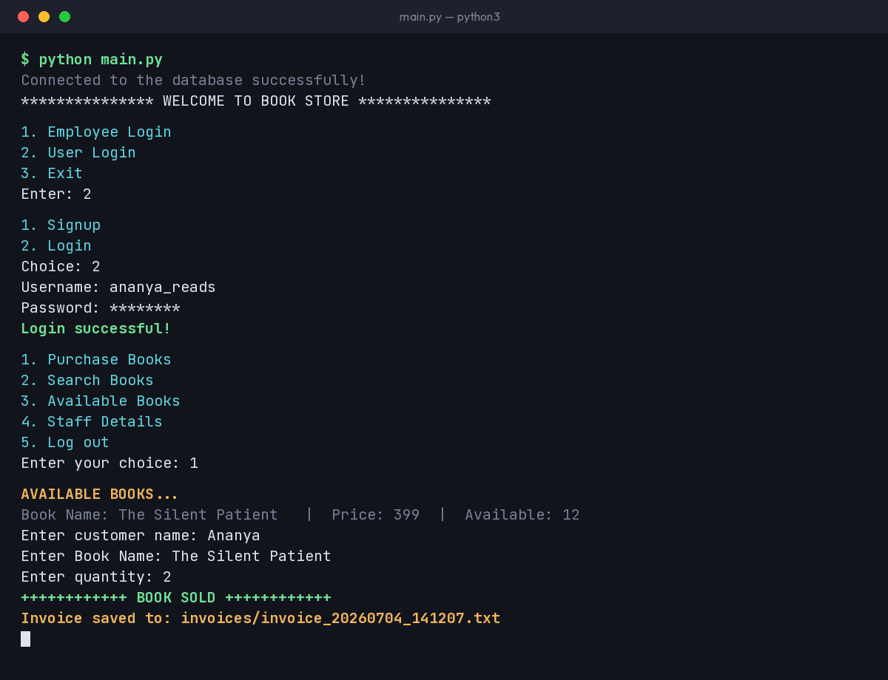

<div align="center">



<br/>

[](https://www.python.org/)
[](https://www.mysql.com/)
[](LICENSE)
[](#-security)

**A modular Python + MySQL bookstore management system** — inventory,
staff records, purchases, and admin controls, wrapped in a clean
menu-driven CLI.

</div>

---

## 📖 Table of Contents

- [Overview](#-overview)
- [Features](#-features)
- [Architecture](#️-architecture)
- [Demo](#-demo)
- [Getting Started](#-getting-started)
- [Database Setup](#️-database-setup)
- [Project Structure](#-project-structure)
- [Security](#-security)
- [Roadmap](#️-roadmap)
- [License](#-license)

---

## 🔎 Overview

This started as a first year single-file script and has since been
rebuilt into a proper modular application: six focused Python modules,
parameterized SQL everywhere, hashed passwords, a real admin login
system, and automatic invoice generation on every sale.

---

## ✨ Features

<table>
<tr>
<td width="50%" valign="top">

### 👨‍💼 Admin / Staff
*(behind admin login)*
- Add new books to inventory
- Add / remove / view staff records
- View & reset sales history
- View total income
- View available stock

</td>
<td width="50%" valign="top">

### 👤 Buyer
- Sign up & log in (hashed passwords)
- Purchase books → auto-generated invoice
- Search by name, genre, or author
- View available books
- View staff directory

</td>
</tr>
</table>

---

## 🏗️ Architecture

<div align="center">

</div>

Six modules, each with one job — no more 400-line single file:

| Module | Responsibility |
|---|---|
| `config.py` | Loads DB credentials from environment variables |
| `db.py` | Connection handling + parameterized query helpers |
| `auth.py` | PBKDF2 password hashing, buyer login, admin login |
| `inventory.py` | Add / search / view books |
| `staff.py` | Staff record management |
| `sales.py` | Purchases, sell history, income, invoice generation |
| `main.py` | Entry point — menus and program flow |

---

## 🎬 Demo

<div align="center">

</div>

---

## 🚀 Getting Started

### 1. Clone & install dependencies

```bash
git clone https://github.com/ananyaacodes/Book-Store-Management-System.git
cd Book-Store-Management-System
pip install -r requirements.txt
```

### 2. Configure your database credentials

```bash
cp .env.example .env
```

```env
DB_HOST=localhost
DB_USER=root
DB_PASSWORD=your_mysql_password_here
DB_NAME=bookstore
```

`.env` is git-ignored, so your real credentials never get committed.

### 3. Run it

```bash
python main.py
```

Tables are created automatically on first run. You'll also be
prompted to create the first **admin account** the very first time
you launch the program.

---

## 🗄️ Database Setup

Create the database once — everything else is handled for you:

```sql
CREATE DATABASE bookstore;
```

`db.ensure_schema()` creates all five tables on first run:
`available_books`, `staff_details`, `sell_rec`, `signup`, and
`admin_credentials`.

---

## 📁 Project Structure

```
Book-Store-Management-System/
│
├── config.py            # Environment-based configuration
├── db.py                 # Connection + parameterized queries
├── auth.py                # Password hashing, buyer + admin login
├── inventory.py            # Book catalog operations
├── staff.py                 # Staff record management
├── sales.py                  # Purchases, income, invoices
├── main.py                    # Entry point
│
├── assets/                     # README images
├── invoices/                    # Auto-generated invoice files
├── requirements.txt
├── .env.example
├── .gitignore
└── README.md
```

---

## 🔐 Security

This refactor closed the gaps a typical first-pass CRUD project has:

- **No more SQL injection** — every query uses parameterized
  placeholders (`%s`) instead of f-string-built SQL.
- **No more hardcoded credentials** — DB password lives in a
  git-ignored `.env` file, loaded via `config.py`.
- **No more plaintext passwords** — buyer and admin passwords are
  hashed with **PBKDF2-HMAC-SHA256** (200,000 iterations, random
  16-byte salt per user) before touching the database.
- **Real admin gate** — the staff menu now requires a genuine login
  instead of being open to anyone who picks "Employee Login."

---

## 🗺️ Roadmap

- [x] Modular six-file architecture
- [x] Parameterized queries throughout
- [x] Environment-based credentials
- [x] Hashed passwords (PBKDF2)
- [x] Admin login system
- [x] Automatic invoice generation
- [ ] Tkinter GUI
- [ ] Email notifications on purchase

---

## 📜 License

Released under the [MIT License](LICENSE).
